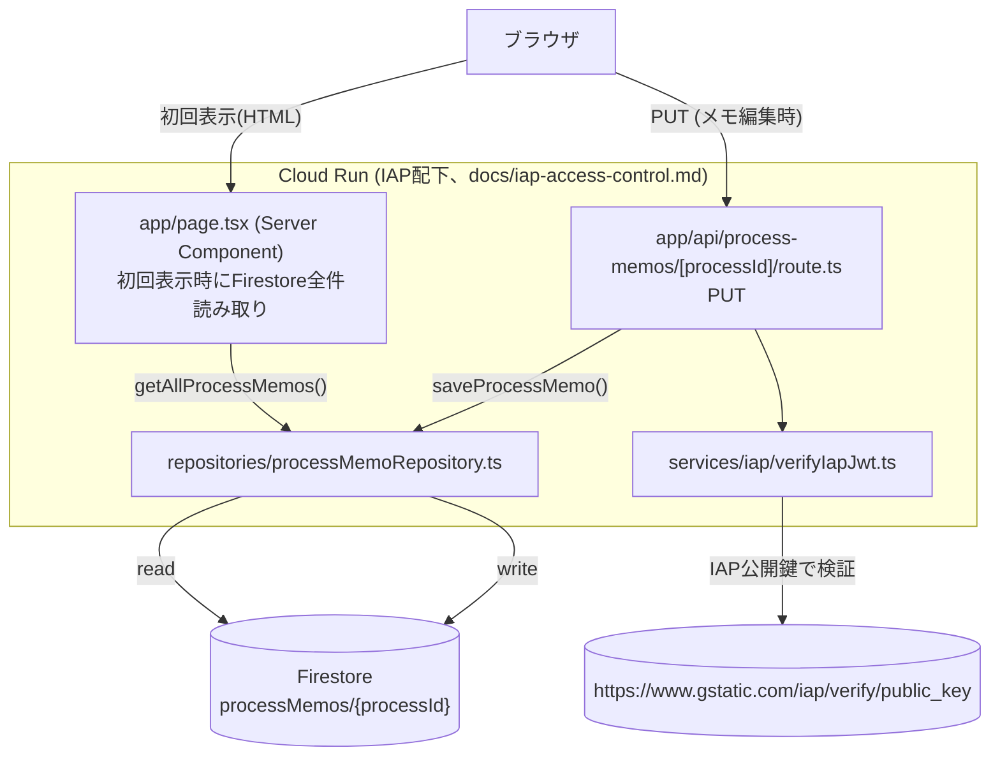

# ダッシュボード独自メモ（Firestore + IAP検証API）設計

CR別タブ下部の案件一覧（WOM_CR1〜4相当）に、Salesforceのmemo__cとは別に
ダッシュボード側だけで追加・編集できるメモ機能（ユーザー確定、2026-09-11）。
Salesforceの既存データは一切変更しない。

## 1. 全体構成



ブラウザはFirestoreに直接触れない。読み取りはSSR、書き込みはCloud Run上のAPIルート
経由のみ（ユーザー確定）。

## 2. Firestoreコレクション設計

```
processMemos/{processId}     ← ドキュメントID = Process__cのSalesforce Id
  processId : string
  crId      : "CR1" | "CR2" | "CR3" | "CR4"
  memo      : string
  updatedBy : string   (IAP検証済みJWTのemail。クライアント入力は使わない)
  updatedAt : Timestamp
```

案件1件につき1ドキュメント。履歴は持たず常に上書き（ユーザー確定、今回は版管理不要）。

## 3. IAP JWT検証（services/iap/verifyIapJwt.ts）

書き込みAPIのみ、IAPが付与する`X-Goog-Iap-Jwt-Assertion`をサーバー側で検証する
（`X-Goog-Authenticated-User-Email`は使わない・補助情報にも使っていない）。

検証は`google-auth-library`の`OAuth2Client.verifySignedJwtWithCertsAsync()`に委ねる
（実装を直接確認済み、node_modules/google-auth-library/build/src/auth/oauth2client.js）:

- IAP公開鍵（`https://www.gstatic.com/iap/verify/public_key`）でES256署名検証
- `iat`/`exp`の標準クレーム検証（期限切れ・未来すぎる有効期限を拒否）
- `aud`が`IAP_EXPECTED_AUDIENCE`と完全一致するかの検証
- `iss`が`https://cloud.google.com/iap`であることの検証

検証済みJWTの`email`クレームのみを`updatedBy`に使う。リクエストボディに
emailフィールド自体を設けておらず、クライアント入力のemailが混入する経路がない。

検証に失敗した場合（ヘッダー無し・署名不正・aud不一致・期限切れ等、理由を問わず）は
常に403のみを返す。**重要**: google-auth-libraryが投げる例外の`message`には検証対象の
JWT本体がそのまま含まれることがある（実装確認済み、例:
`"Invalid token signature: " + jwt`）。そのためcatch節では例外オブジェクトを一切
ログに出さず、固定文言＋カテゴリ（`missing_config`/`missing_header`/`verification_failed`）
のみを出力する。

### IAP_EXPECTED_AUDIENCEの決め方（ユーザー確定）

Cloud Runネイティブ統合時のIAP JWT `aud`書式は情報源により食い違いがあり
（`/projects/{番号}/locations/{region}/services/{name}`とする記述と、旧来の
`/projects/{番号}/global/backendServices/{ID}`のままとする記述が混在）、コードで
組み立てると誤った書式を検証に使ってしまうリスクがある。そのため**aud文字列は
コードで組み立てず**、Google Cloud Console → セキュリティ → Identity-Aware Proxy →
対象Cloud Runサービスの行 → ⋮ →「Get JWT Audience Code」で取得した値を、
環境変数`IAP_EXPECTED_AUDIENCE`としてそのまま渡す。

- 変数名はdev/prod共通で`IAP_EXPECTED_AUDIENCE`（値は環境ごとに別々）
- `cloudbuild.yaml`の置換変数`_IAP_EXPECTED_AUDIENCE`経由で設定する
  （`_SALES_DATA_SOURCE`と同じ運用。実際の値は各ビルドトリガー側で設定）
- 未設定の場合、書き込みAPIはfail-closedで常に403（`verifyIapJwt`が
  `missing_config`を返す）。**ダッシュボード本体の閲覧（SSR）はこのAPIと独立して
  おり、影響を受けない**

## 4. 必要なGCP設定（未実施、`tcd-dashboard`プロジェクト）

- `firestore.googleapis.com`の有効化
- Firestoreデータベース（Nativeモード、`asia-northeast1`）の作成
  （1プロジェクトにつき既定データベースは1つのみ。他用途で既存でないか要確認）
- Cloud Run実行サービスアカウントへの`roles/datastore.user`付与
- dev/prodそれぞれのCloud Runサービスに対応するIAP JWT Audience Codeの取得と、
  ビルドトリガー側`_IAP_EXPECTED_AUDIENCE`への設定

## 5. テスト方針

Salesforce連携と同じ「フェイク注入、実ネットワーク不使用」の方針を踏襲する。

- `verifyIapJwt.test.ts`: `google-auth-library`をvi.mockし、検証成功/失敗
  （設定なし・ヘッダーなし・署名検証失敗・emailクレーム欠如）を検証。例外内容が
  ログに出ないことも回帰テストで固定
- `processMemoRepository.test.ts`: Firestore実体の代わりに`ProcessMemoStore`
  インターフェースのフェイクを注入
- `route.test.ts`: `verifyIapJwt`/`saveProcessMemo`をモックし、入力検証・
  ステータスコード・emailの取り扱い（クライアント入力のemailが無視されること）を検証
