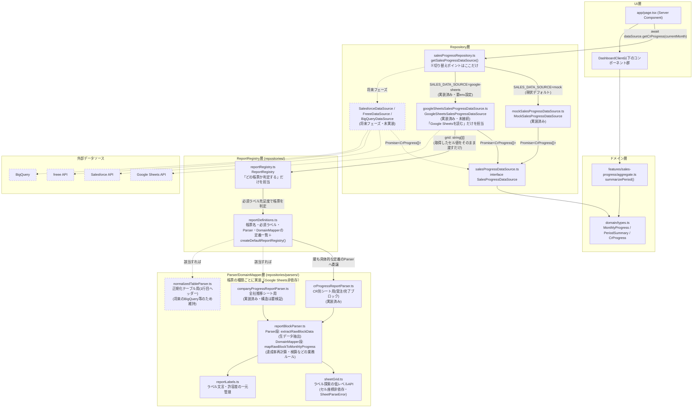

# Repository構成（データソース抽象化）

## 目的

UI層がモックかGoogle Sheetsか（さらに将来はSalesforce／freee／BigQuery）を意識しなくて済むようにする。差し替えは`salesProgressRepository.ts`一箇所のみ。

## 構成図

点線＝未実装、または実装済みでも未接続／未確定の候補。実線＝実装済みかつ接続可能。
`Sheets→SheetsAPI`が点線なのは、コードは実装済みだがスプレッドシートID・シート名が未確認で実際のAPI呼び出しはまだ行っていないため（`docs/sheet-mapping.md`参照）。`CompanyParser`は構造が未検証のため破線枠。`NormalizedParser`はGoogle Sheets以外のデータソース（BigQuery等）でも使えるよう`ReportRegistry`に登録済みだが、現状のGoogle Sheets実データでは`CrParser`が選ばれる想定。

**ポイント**: `GoogleSheetsSalesProgressDataSource`は「Google Sheetsを読む」（グリッド取得）だけを担当し、grid（`string[][]`）をそのまま`ReportRegistry`へ渡す。「どの帳票か判定する」責務は`ReportRegistry`にあり、判定結果に応じて選ばれるParser/DomainMapperは帳票の種類（CR別シート／全社推移／正規化テーブル）だけに依存し、Google Sheets固有の型やAPIを一切知らない（入力は素の`string[][]`グリッド）。将来Salesforce/BigQuery等から同じ帳票形式のデータが来ても、Parser層はそのまま再利用できる。

## 各層の責務

| ファイル | 責務 | 実装状況 |
|---|---|---|
| `src/repositories/salesProgressDataSource.ts` | `SalesProgressDataSource`インターフェース定義 | 実装済み |
| `src/repositories/mockSalesProgressDataSource.ts` | モックデータ生成（乱数シード、9月始まりの事業年度に対応） | 実装済み |
| `src/repositories/salesProgressRepository.ts` | `SALES_DATA_SOURCE`環境変数で実装を選択する唯一の切り替えポイント | 実装済み（`mock`/`google-sheets`両対応） |
| `src/services/google-sheets/sheetsClient.ts` | Sheets APIから列全体（セル座標指定なし）の生データを取得 | 実装済み |
| `src/services/google-sheets/cellValueParsing.ts` | 金額・月文字列のパース共通処理 | 実装済み（normalizedTableParser・帳票Parser共通） |
| `src/config/googleSheets.ts` | シート参照（env変数解決）・正規化テーブル用ヘッダー文言の定義 | 実装済み（値はプレースホルダー） |
| `src/repositories/reportRegistry.ts` | `ReportRegistry`。グリッドがどの帳票か判定し、対応するParser→DomainMapperへ委譲する（「Google Sheetsを読む」ことは知らない） | 実装済み |
| `src/repositories/reportDefinitions.ts` | 帳票定義（帳票名・必須ラベル・Parser・DomainMapper）の一覧と`createDefaultReportRegistry()` | 実装済み |
| `src/repositories/parsers/sheetGrid.ts` | ラベル探索の低レベルAPI。セル座標を一切扱わない | 実装済み |
| `src/repositories/parsers/reportLabels.ts` | 探索対象ラベル・許容差の一元管理 | 実装済み（ラベル文言はプレースホルダー） |
| `src/repositories/parsers/domainMapping.ts` | `DomainMapContext`/`DomainMapResult`の共通型定義 | 実装済み |
| `src/repositories/parsers/reportBlockParser.ts` | Parser段(`extractRawBlockData`＝生データ抽出)とDomainMapper段(`mapRawBlockToMonthlyProgress`＝達成率再計算・検算)を分離して提供 | 実装済み |
| `src/repositories/parsers/crProgressReportParser.ts` | CR別シート（受注/完了ブロック）専用。Raw抽出とDomainMapperの両関数を公開 | 実装済み |
| `src/repositories/parsers/companyProgressReportParser.ts` | 全社推移シート専用。Raw抽出とDomainMapperの両関数を公開 | 実装済み（構造未検証、フォールバック付き） |
| `src/repositories/parsers/normalizedTableParser.ts` | 正規化テーブル用。Raw抽出とDomainMapperの両関数を公開 | 実装済み（`ReportRegistry`には登録済み、現状のGoogle Sheets実データでは未選択） |
| `src/repositories/googleSheetsSalesProgressDataSource.ts` | CR1〜3シートを取得し、gridをそのまま`ReportRegistry`へ渡してCrProgress[]へ変換。失敗時は`SalesDataSourceError`を投げる | 実装済み（実際のスプレッドシートへの接続は未確認情報待ちのため未実施） |
| `src/repositories/salesDataSourceError.ts` | `SalesDataSourceError`／`classifySheetsError()`。例外を固定カテゴリ(AUTH_ERROR/NOT_FOUND/NETWORK_ERROR/PARSE_ERROR/CONFIG_ERROR/UNKNOWN_ERROR)へ分類し、金額・認証情報等の詳細を運ばない | 実装済み |
| `src/repositories/sumMonthlyProgressAcrossCr.ts` | 全社(ALL)集計。月の値でグルーピングするためCRごとの行順・欠落に依存しない。未入力(null)のCRは合算対象から除外 | 実装済み（Mock/Sheets共通） |
| `scripts/inspectSheets.ts` | 実シート構造の調査用診断スクリプト（`npm run inspect:sheets`） | 実装済み（env未設定のため未実行） |
| `src/app/page.tsx` | `getSalesProgressDataSource()`を呼ぶだけ。実装の種類を知らない。取得失敗時は`DataFetchErrorState`を表示（Mockへの自動フォールバックはしない） | 実装済み |
| `src/components/DataFetchErrorState.tsx` | 汎用エラー表示（「営業進捗データを取得できませんでした」のみ、内部情報は非表示） | 実装済み |
| `src/components/RefreshButton.tsx` | `router.refresh()`でServer Componentを再実行し再取得するボタン | 実装済み |
| UI層（`DashboardClient`以下） | `CrProgress[]` / `MonthlyProgress` / `PeriodSummary`というドメイン型のみに依存 | 変更不要（モック→Google Sheets切り替え時も無改修） |

## エラーハンドリング方針（ユーザー指定、2026-08-06）

Sheets API接続失敗・権限不足・対象シートなし・必須ラベル不足・数値変換失敗・帳票判定不能のいずれも、最終的に`GoogleSheetsSalesProgressDataSource`が`SalesDataSourceError`（固定カテゴリのみを持つ）に変換して投げる。`app/page.tsx`がこれを捕捉し、

- **画面**: 「営業進捗データを取得できませんでした」のみを表示（`DataFetchErrorState`）。原因やシート名などの内部情報は一切表示しない
- **サーバーログ**: `sheet=<シート名> category=<固定カテゴリ>`のみを出力（`console.error`）。金額・認証情報・アクセストークン・元の例外メッセージは出力しない
- **フォールバックしない**: 取得に失敗してもMockへは自動的に切り替えない（本番で誤った数値を表示する危険があるため、ユーザー明示指示）。`SALES_DATA_SOURCE`環境変数を変更しない限りデータソースは変わらない

「一部月の未入力」はエラーではなく正常系として扱う（1.5節参照、`null`として表現しUIは「—」表示）。

## 将来フェーズへの拡張方法（Salesforce / freee / BigQuery）

1. `SalesProgressDataSource`を実装する新しいクラス（例: `SalesforceSalesProgressDataSource`）を`src/repositories/`に追加
2. `salesProgressRepository.ts`の`switch`文に`case`を1行追加
3. UI層・ドメイン層は無改修
4. データが正規化テーブル形式（1行目ヘッダー）であれば`normalizedTableParser.ts`をそのまま再利用できる

この構成により「第1フェーズ：Google Sheets → 第2フェーズ：Salesforce → 第3フェーズ：freee → 第4フェーズ：BigQuery」への移行時も、画面側のコードは変更不要という要件を満たす。

## 全社集計の切り替えについて

初期フェーズは`CrProgress`の`ALL`エントリを`sumMonthlyProgressAcrossCr.ts`で「CR1+CR2+CR3の単純合算」として算出する（月の値でグルーピングするためCRごとに行順が異なっても正しく合算される）。将来、全社推移シートを直接読む方式に切り替える場合は、`companyProgressReportParser.ts`（実装済み・構造は要検証）を使うよう`GoogleSheetsSalesProgressDataSource`を差し替えるだけでよく、UI・集計層（`summarizePeriod`等）は無改修で対応できる。

## セル座標をハードコードしない設計（ユーザー指定、2026-08-06）

`GoogleSheetsSalesProgressDataSource`は個別セルではなく**シートの列全体**（`'シート名'!A:Z`）を取得する。実シートが帳票形式（月が横方向、受注/完了が左右のブロック、売上・粗利・粗利達成率が縦方向）であることが判明したため、`crProgressReportParser.ts`が「受注」「完了」等のラベル文字列をシート全体から探索し、その相対位置を基準にブロック（列範囲）を特定、ブロック内でさらに行・列ラベルを探索して値を取り出す（`repositories/parsers/`、詳細は`docs/sheet-mapping.md`）。列の追加・移動・並べ替えに影響されない。

四半期・上半期・通期はシート側に集計列があっても月別データからアプリ側で再集計する（正データにしない）。粗利達成率も同様に`grossProfit ÷ targetGrossProfit`で必ず再計算する。シート側の値は検算にのみ使い、差異が許容範囲を超えたら警告ログを出す（`reportLabels.ts`の`ACHIEVEMENT_RATE_TOLERANCE_POINTS` / `AMOUNT_TOLERANCE_YEN`）。
